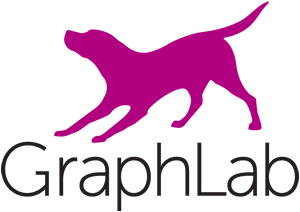
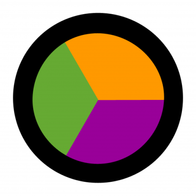

## [PhotoPro](<http://photopro.science>)
An intelligent photo analysis tool for making predictions on Flickr views and professional status of the photographer.

### Summary
*PhotoPro* is meant to help you pick better photos. Whether you are a marketer, professional photographer, or social media enthusiast, getting your photos online is an integral part of your business and/or identity.

Choosing the best photos to attract attention is often a matter of opinion. While it might be easy to identify the wrong photo, choosing the right photo that makes uses *want* to look at your ad is tough.

*PhotoPro* can help guide that decision. Trained on over 100,000 images from Flickr, it can predict with high precision and recall where on a distribution of past performance metrics your photo will perform, based only on the appearance of the photo.

### Dependencies

* [Python](<https://www.python.org/>)
* [Anaconda](<https://www.continuum.io/why-anaconda>)
* [iPython](<https://ipython.org/>)
* [Numpy](<http://www.numpy.org/>)
* [Pandas](<http://pandas.pydata.org/>)
* [SKLearn](<http://scikit-learn.org/>)
* [Graphlab by Turi (previously Dato)](<https://turi.com/>)
* [Scikit-Image](<http://scikit-image.org/>)
* [SciPy](<https://www.scipy.org/>)
* [Flask](<http://flask.pocoo.org/>)
* [Jinja2](<http://jinja.pocoo.org/>)
* [Start Bootstrap](<https://startbootstrap.com/>)
* [Flot](<http://www.flotcharts.org/>)
* [Beautiful Soup](<https://www.crummy.com/software/BeautifulSoup/>)

### Workflow: CRISP-DM

Development of *PhotoPro* followed CRISP-DM best practices:

#### Business Understanding
Everyone who uses photos online is betting that someone wants to see it. Whether that image will actually attract views is another story. Multimillion dollar advertising campaigns can depend heavily on images to attract attention. The ability to predict accurately the performance of a photo online would be of great value in many contexts, including to those buying stock and advertising photos, those advertising professional services, and those posting to their social media accounts.

The goal of this project is to provide accurate predictions of a photo's view total and professionalism based on the raw image data.

#### Data Acquisition
Data for the project was obtained from the Flickr API. Starting with a keyword search (like "portrait", or "buildings"), meta data for the search results are downloaded and stored in .CSV files. Next, using the data returned, links to the the raw image files are constructed, and then the images are sequentially downloaded and saved.

#### Exploratory Data Analysis
While writing the script to download meta data, I explored the information returned by the Flickr API. Flickr provides a respectable amount of information about public photos, including but not limited to all comments, tags, favorites, history, and locations.

##### Feature Engineering
With the raw images and meta data saved, I began exploring the features I could create. Images are generally categorized by many metrics: I focused on four: color spectrum, brightness, sharpness, and color palettes. I wrote a script to analyze each photo for these metrics at a variety of levels of discreetness. For example, the distribution of `red` channel in each photo was binned into 100, 30, and 10 bins. Color was analyzed in RGB, Greyscale, and LUV color spaces. For the sharpness measure, I analyzed each image's Sobel, Canny, and Laplace gradients. I defined the measure of sharpness as the variance of each gradient distribution.

##### Target selection

#### Acknowledgements
http://stackoverflow.com/questions/1994037/flickr-api-returning-duplicate-photos
requests library
beautiful soup library
